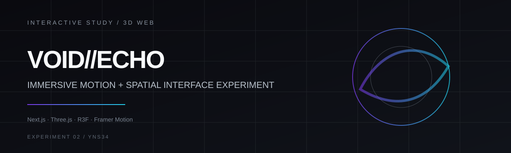

# VOID//ECHO

An experimental web piece exploring **spatial UI, motion systems, and surreal digital storytelling**.

**Status:** visual / interaction study

---

## Concept

VOID//ECHO treats the page as a sequence of visual states rather than a conventional landing page. A persistent 3D scene sits behind the content while typography, scroll position, and interaction effects progressively alter the atmosphere.

The four narrative states are:

1. `DISTORTION` — the interface begins to destabilize
2. `FRAGMENT` — visual continuity splits
3. `CORRUPTION` — signal gives way to noise
4. `TRANSCEND` — the experience resolves into a final state

## Interaction system

- persistent real-time 3D scene
- scroll-driven narrative sections
- dedicated “void mode” state
- particle-style click feedback
- animated typography and transition choreography
- layered motion with Framer Motion / GSAP
- smooth scrolling and responsive composition

## Stack

`Next.js 16` · `React 19` · `TypeScript` · `Three.js` · `React Three Fiber` · `Drei` · `React Three Postprocessing` · `Framer Motion` · `GSAP` · `Lenis` · `Tailwind CSS 4`

## Structure

```text
src/
├── app/            # page composition and application shell
├── components/     # 3D scene, UI, and narrative sections
├── hooks/          # interaction/state hooks
└── utils/          # shared utilities
```

## Run locally

```bash
npm install
npm run dev
```

Production checks:

```bash
npm run build
npm run lint
```

## Notes

This repository is intentionally an **experiment**, not a production product. The focus is visual systems, motion composition, and the relationship between 3D space and interface behavior.
